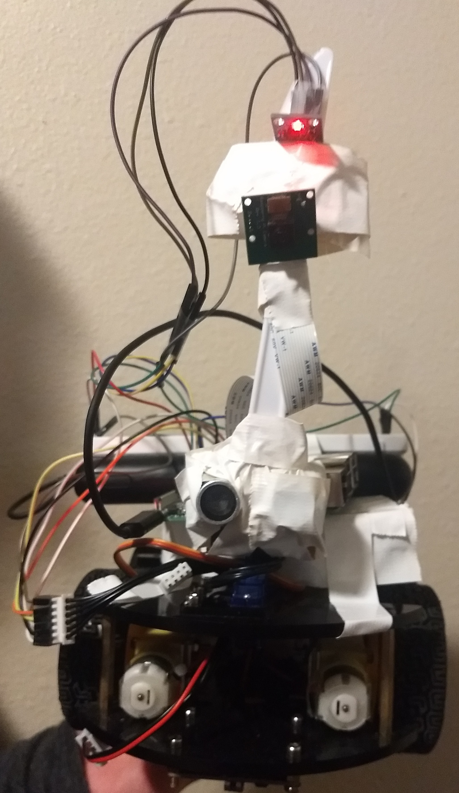
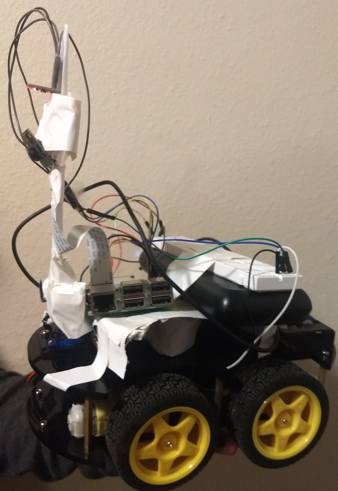
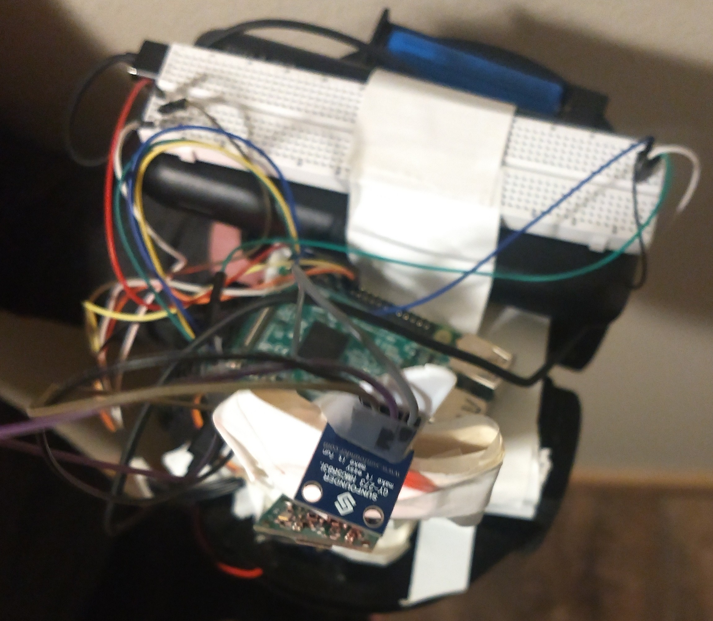
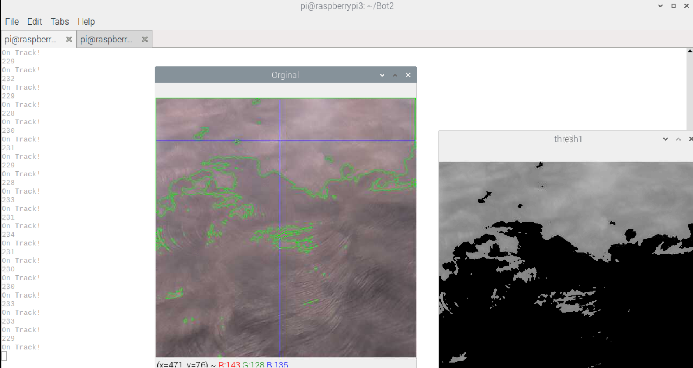

Project Summary
===============

Build a autonomous robot that can drive on a sidewalk without exterior support.

Requirements
------------
* Mobile robot
* Attempt the challenge course

This project could include the following techniques listed below that was taught this semester:

* Vehicle design and steering
* Power and movement
* Controls
* Navigation and routing

Componets
---------
+----------------------------------------+--------------------+-----------+
|Name                                    | Orginal cost ($)   | Pre-owned |
|                                        |                    |           |
+========================================+====================+===========+
|RaspberryPi 3b+                         |     35.00          |  Yes      |
+----------------------------------------+--------------------+-----------+
|AuviPal 5 Megapixels Raspberry Pi Camera|     9.49           |  No       |
+----------------------------------------+--------------------+-----------+
|L298N motor driver board                |     14.99          |  Yes      |
+----------------------------------------+--------------------+-----------+
|Motor (4)                               |     N/A            |  Yes      |
+----------------------------------------+--------------------+-----------+
|Wheel (4)                               |     N/A            |  Yes      |
+----------------------------------------+--------------------+-----------+
|HMC5883L compass(not used)              |     9.95           |  Yes      |
+----------------------------------------+--------------------+-----------+
|Breadboard                              |     2.99           |  Yes      |
+----------------------------------------+--------------------+-----------+
|Power Bank  5V/3A                       |     29.99          |  Yes      |
+----------------------------------------+--------------------+-----------+
|18650 LiPo Batteries (2)                |     14.99          |  Yes      |
+----------------------------------------+--------------------+-----------+
|Micro SD card (8gb)                     |     5.90           |  Yes      |
+----------------------------------------+--------------------+-----------+
|etc.                                    |     N/A            |  Yes      |
+----------------------------------------+--------------------+-----------+

From Scratch      ~  $123.30

Cost for Semester -  $9.49

Description of the Design
-------------------------
Our Robot is controlled by a RaspberryPi 3b+. A camera is attatcted to a
plastic knife to give a higher perspective. The motors are connected to L298N
controlled by the Pi. 
Our Robot was constructed of previous parts from past classes.
Below is a top, side, and front picture of our Robot.

 

Construction of Robot 
---------------------
Pins 17, 22, 23, 24 of the Raspberry Pi are connected to the L298N 
motor driver board's M4, M3, M2, M1 respectively and 5V to ENA and ENB.
The 18650 LiPo Batteries are placed in series to power the 
motors. It is important to note that the ground off of the Pi and 
the ground off of the LiPo need to share a common ground.
The power bank is plugged into the Raspberry Pi using a micro-usb.
The Camera is connected to the camera port labeled on the Pi, and is
attached to an arm to have a higher view point at a angled 
about 45 degrees downward.   

Discription of Software
-----------------------
The program starts by initializing the motors and declaring camera 
specifications. A x coordinate is determined form the contour when trying to find the sidewalk. The  
Robot will either drive "straight" if x is between pixel 200-300, turn left if x>300, and turn right if x<200. 
This was done with a very simple proportional
contoller.

When the program is running a display of what the robot is seeing is shown.
The contour are showing the  exactly point of interest that the Robot is looking at. The command prompt
shows the x contour and if it is on track, turn left, or turn right.
An example display is shown below.

Description of Capabilities
---------------------------
The Robot should be able to drive on straight and curved sidewalks. However,
there are some instants where it has trouble determinig the difference between dead grass/snow/shadows and concrete, the Robot will
drive to that target. The Robot does not prefrom well with obstacles. 

Results & Future Modifications
------------------------------
The Robot was able to drive along the sidewalk.... most of the time. If the Robot saw a shadow or snow it would
not adjust course. Adjustments that could be and that could have a impact on the robot include:

+--------------------------+----------------------------------+
|Modification              |Impact                            |
|                          |                                  |
+==========================+==================================+
|Increased Camera Height   |Having a higher camera would      |
|                          |allow the Robot to see the        |
|                          |edges sooner.                     |
+--------------------------+----------------------------------+
|Intergrate Compass        |Would allow the robot to drive    |
|                          |straighter.                       |
+--------------------------+----------------------------------+
|Mapped Out Desired Path   |Allow the robot to know how to    |
|                          |drive.                            |
+--------------------------+----------------------------------+
|Encoder                   |Help to determine location of     |
|                          |the Robot.                        |
+--------------------------+----------------------------------+

